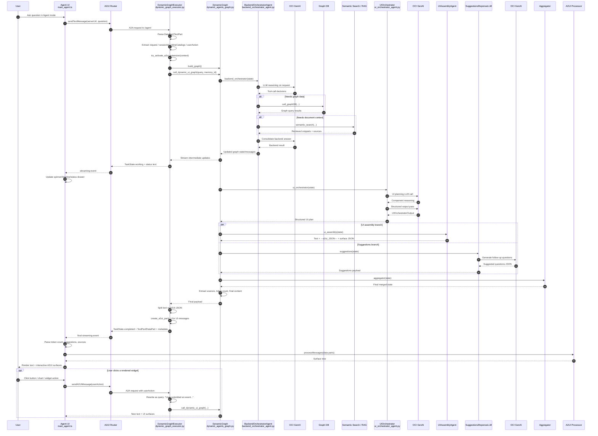

# Dynamic Agent Flow Sequence Diagram

```mermaid
sequenceDiagram
    autonumber

    participant U as User
    participant C as Agent UI<br/>main_agent.ts
    participant R as A2UI Router
    participant E as DynamicGraphExecutor<br/>dynamic_graph_executor.py
    participant G as DynamicGraph<br/>dynamic_agents_graph.py
    participant B as BackendOrchestratorAgent<br/>backend_orchestrator_agent.py
    participant OCI1 as OCI GenAI
    participant GraphDB as Graph DB
    participant RAG as Semantic Search / RAG
    participant UIO as UIOrchestrator<br/>ui_orchestrator_agent.py
    participant OCI2 as OCI GenAI
    participant UIA as UIAssemblyAgent
    participant S as SuggestionsReponseLLM
    participant OCI3 as OCI GenAI
    participant A as Aggregator
    participant P as A2UI Processor

    U->>C: Ask question in Agent mode
    C->>R: sendTextMessage(serverUrl, question)
    R->>E: A2A request to /agent

    E->>E: Parse DataPart/TextPart
    E->>E: Extract request / sessionId / inlineCatalogs / userAction
    E->>E: try_activate_a2ui_extension(context)
    E->>G: build_graph()
    E->>G: call_dynamic_ui_graph(query, memory_id)

    G->>B: backend_orchestrator(state)
    B->>OCI1: LLM reasoning on request
    OCI1-->>B: Tool-call decisions

    alt Needs graph data
        B->>GraphDB: call_graphDB(...)
        GraphDB-->>B: Graph query results
    end

    alt Needs document context
        B->>RAG: semantic_search(...)
        RAG-->>B: Retrieved snippets + sources
    end

    B->>OCI1: Consolidate backend answer
    OCI1-->>B: Backend result
    B-->>G: Updated graph state/messages

    G-->>E: Stream intermediate updates
    E-->>R: TaskState.working + status text
    R-->>C: streaming-event
    C->>C: Update spinner/timeline/status drawer

    G->>UIO: ui_orchestrator(state)
    UIO->>OCI2: UI planning LLM call
    OCI2-->>UIO: Component reasoning
    UIO->>OCI2: Structured output pass
    OCI2-->>UIO: UIOrchestratorOutput
    UIO-->>G: Structured UI plan

    par UI assembly branch
        G->>UIA: ui_assembly(state)
        UIA-->>G: Text + ---a2ui_JSON--- + surface JSON
    and Suggestions branch
        G->>S: suggestions(state)
        S->>OCI3: Generate follow-up questions
        OCI3-->>S: Suggested questions JSON
        S-->>G: Suggestions payload
    end

    G->>A: aggregator(state)
    A-->>G: Final merged state

    G->>G: Extract sources, token count, final content
    G-->>E: Final payload

    E->>E: Split text vs A2UI JSON
    E->>E: create_a2ui_part(...) for UI messages
    E-->>R: TaskState.completed + TextPart/DataPart + metadata
    R-->>C: final streaming-event

    C->>C: Parse token count, suggestions, sources
    C->>P: processMessages(data parts)
    P-->>C: Surface tree
    C-->>U: Render text + interactive A2UI surfaces

    opt User clicks a rendered widget
        U->>C: Click button / chart / widget action
        C->>R: sendA2UIMessage(userAction)
        R->>E: A2A request with userAction
        E->>E: Rewrite as query: "User submitted an event..."
        E->>G: call_dynamic_ui_graph(...)
        G-->>C: New text + UI surfaces
    end
```
